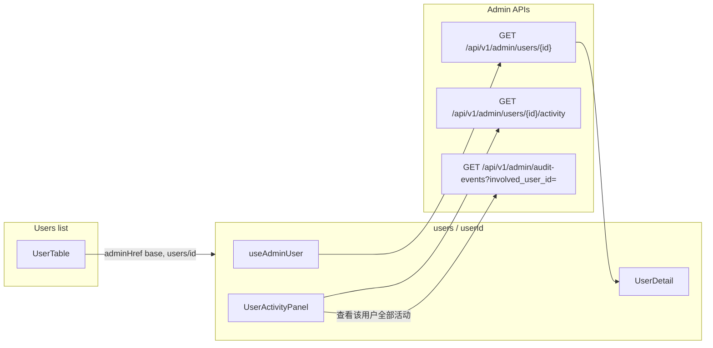
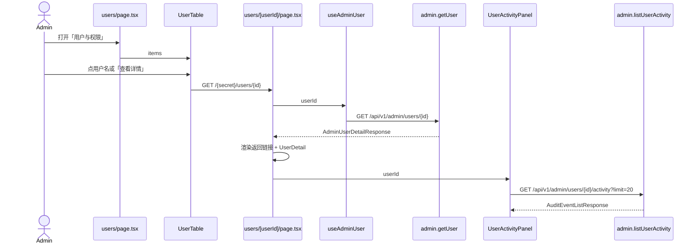

# 管理员用户详情档案页设计

| 字段 | 值 |
| --- | --- |
| 标题 | 管理员用户详情档案页（User Dossier） |
| 作者 | Kinema |
| 日期 | 2026-08-13 |
| 状态 | Draft |
| Issue | [#110](https://github.com/LeeShunEE/Radar-Renderer/issues/110) |
| 落地路径 | `docs/plans/2026-08-13-admin-user-detail-design.md` |
| 关联一期 | [#89](https://github.com/LeeShunEE/Radar-Renderer/issues/89) / `docs/superpowers/specs/2026-07-29-admin-console-design.md` §7.3、§8 |
| 基线 | `main` @ `4dbd41f` |

本文件是 **#110 的新功能设计**，不是对 `2026-07-29-admin-console-design.md` 的修订。一期规格仍是权威；本文只补「点进用户档案」这一缺口。提交时按仓库惯例落到 `docs/plans/2026-08-13-admin-user-detail-design.md`。

---

## Overview

一期管理员控制台已经交付「用户与权限」列表（`frontend/src/app/control-internal/users/page.tsx`）和详情路由骨架（`users/[userId]/page.tsx`）。列表能看到最近登录，用户名也是链接，但点进去之后 `UserDetail` 只渲染 id / username / email 和用量数字，**不展示** `created_at`、`last_login_at`、`is_verified`、`is_admin`、`is_active`、`display_name`，也不调用已经存在的 `GET /api/v1/admin/users/{user_id}/activity`。管理员排查账号时仍只能盯着列表上的「最近登录」。

本设计在现有 `[userId]` 档案页上补齐身份头、返回导航、最近活动预览，并在列表增加明确的「查看详情」入口。后端两处小补丁：`AdminUserResponse` 补上领域 `User.display_name`；`GET /api/v1/admin/audit-events` 暴露 DAO 已支持的 `involved_user_id`，让「查看该用户全部活动」与详情预览、`usage.activity_count` 是同一集合。不新开 service、不新表、不引入 RBAC / 模拟登录 / 管理员重置密码。

---

## Background & Motivation

### 当前状态（已核对代码）

**列表页已经能点进去。** `UserTable.userHref` 在 **render 时**直接读 `window.location.pathname` 第一段拼 `/${secret}/users/${id}`。`AdminShell` 则用 `useState("")` + `useEffect` 推迟拼 href，避免 SSR / 首屏 hydration 不一致。两边各写了一份「取第一段」逻辑，且 `UserTable` 已经有 hydration 风险：首屏 client 有 `window`，会直接吐出真实 secret 路径。

公开管理前缀是 `proxy.ts` 对 `/control-internal` 的运行时 rewrite，用户可见 href 必须来自地址栏第一段，不能用 rewrite 后的 `usePathname()`。

**详情页是半成品。**

```18:24:frontend/src/components/admin/users/UserDetail.tsx
  return (
    <div className="space-y-5">
      <section className="border border-cyan-100/10 bg-[#0d1b2e] p-5">
        <p className="font-mono text-xs text-cyan-300">USER / {detail.user.id}</p>
        <h2 className="mt-2 text-xl font-semibold">{detail.user.username ?? "未设置用户名"}</h2>
        <p className="mt-1 text-sm text-slate-400">{detail.user.email}</p>
      </section>
```

`AdminUserDetailPage` 只调 `admin.getUser(userId)`，没有返回列表链接，也没有活动区。页面内联 `useEffect` 拉详情，没有对应 hook（与 `useAdminUsers` / `useAuditEvents` 的分层不一致）。

**后端详情接口已经够用。** `UserAdminService.get_user_detail` 返回 `AdminUserDetail { user: User, usage: UserUsageSummary }`。领域 `User`（`backend/app/models/user.py`）已有 `display_name`、`last_login_at`、`created_at`、`is_verified`、`is_admin`、`is_active`。`UserDAO._to_user` 已映射 `display_name`。缺口只在接口层：

```65:86:backend/app/schemas/admin.py
class AdminUserResponse(BaseModel):
    id: int
    username: str | None
    email: EmailStr
    is_verified: bool
    is_admin: bool
    is_active: bool
    last_login_at: datetime | None
    created_at: datetime

    @classmethod
    def from_domain(cls, user: User) -> "AdminUserResponse":
        return cls(
            id=user.id,
            username=user.username,
            email=user.email,
            is_verified=user.is_verified,
            is_admin=user.is_admin,
            is_active=user.is_active,
            last_login_at=user.last_login_at,
            created_at=user.created_at,
        )
```

对比 `UserResponse.from_domain`（`backend/app/schemas/auth.py`）已经输出 `display_name`。管理员契约漏了同一字段。

**活动 API 已存在，前端 client 已封装，页面未用。**

- `GET /api/v1/admin/users/{user_id}/activity`（`audit_router.user_activity`）走 `AuditEventDAO.list(involved_user_id=…)`：actor **或** subject 命中该用户。
- `AuditEventDAO.count_for_user`（用量卡 `activity_count`）用同一套 OR。
- `GET /api/v1/admin/audit-events` 已暴露 `actor_user_id`、`subject_user_id`；DAO.list 已支持 `involved_user_id`，但 **router 没有把它接出去**。
- 前端 `admin.listAuditEvents` 与 `useAuditEvents` 不传用户过滤；`activity/page.tsx` 不读 search params。
- `admin.listUserActivity(userId, beforeId?)` 已实现。

**角色 / 状态变更只挂在列表。** `PATCH /users/{id}/role`、`PATCH /users/{id}/status` 经 `UserAdminService.set_role` / `set_status`，含自我撤权、自我停用、最后一位启用管理员保护。`UserTable` 用 `window.confirm` + 图标按钮，aria-label 分别为 `授予 ${email} 管理员` / `撤销 ${email} 管理员`、`停用 ${email}` / `启用 ${email}`。e2e `admin-user-management.spec.ts` 用 `locator("button").nth(0|1)` 点这些按钮，旅程里四步都会走到（授 → 停 → 启 → 撤）。

**鉴权边界不变。** `CurrentAdminDep` = 有效 JWT + `is_active` + `is_admin`。混淆路径只是 obfuscation。

### 痛点

1. 运营要核对「这个账号何时注册、是否验证、现在是不是管理员、上次登录何时」必须回到列表，而列表一行装不下档案。
2. `display_name` 是 OAuth 用户的主要可读名（见 `User` docstring），管理员契约却丢了，OAuth-only 账号在详情里只剩邮箱。
3. `usage.activity_count` 只是一个数字，无法回答「最近做了什么」。
4. 详情页没有返回入口；浏览器后退可以，但刷新深链或从别处进来时没有明确导航。
5. 用户名链接视觉弱，且没有「查看详情」文案，产品反馈就是「只能在列表里看最近登录」。

---

## Goals & Non-Goals

### Goals

1. 管理员从「用户与权限」点进某个账号，看到完整身份档案，而不只是列表列「最近登录」。
2. 身份头展示：`id`、`username`、`display_name`、`email`、`is_verified`、`is_admin`、`is_active`、`created_at`、`last_login_at`。
3. 保留现有用量汇总与 `storage_partial` 警告。
4. 在详情页展示该用户最近审计活动（复用已有 activity API，首屏 + cursor「加载更早」），并能跳到全局「使用记录」看同一集合。
5. 返回列表的导航在混淆前缀下正确工作，禁止把 `/control-internal` 或 `/admin` 写进用户可见 href。
6. 列表保留用户名链接，并增加明确的「查看详情」控件。
7. `AdminUserResponse` 补齐 `display_name`，走 `from_domain`，领域 `User` 不 import schema。

### Non-Goals

- 不新开 modal / drawer / 独立用户管理应用。一期路由已经是 `[userId]`。
- 不实现多级 RBAC、管理员重置密码、模拟登录（impersonation）。
- 不列出 OAuth 绑定（管理 API 没有该端点；`GET /api/v1/auth/oauth/accounts` 是用户自己的）。
- 不在详情页挂渲染历史。`GET /api/v1/admin/render/history?user_id=` 已存在，列为 follow-up。
- 不在详情页做角色 / 状态 PATCH。变更继续只走列表确认对话框，避免与列表确认文案和最后管理员保护 UX 分叉。
- 不改搜索：`UserDAO.list_filtered` 仍只匹配 email / username，不搜 `display_name`。
- 不加 feature flag。页面继续待在现有 `AdminGuard` 后面。
- 不新增表、不写 Alembic、不改 `AUDIT_RETENTION_DAYS`。
- 不把管理区文案迁到 next-intl。控制台现状是硬编码中文，本次保持一致。
- 不记录密码、token、完整请求体、原始 IP、完整 User-Agent。

---

## Proposed Design

### 总览

在现有骨架上做 **前端补齐 + 两处向后兼容的契约补丁**。数据流如下：





### 1. 契约补丁：`display_name`

只改 `AdminUserResponse` 与 `from_domain`。`AdminUserDetailResponse` / `AdminUserListResponse` 自动继承，因为它们嵌的是同一个 Response。

```python
class AdminUserResponse(BaseModel):
    id: int
    username: str | None
    email: EmailStr
    display_name: str | None = None
    is_verified: bool
    is_admin: bool
    is_active: bool
    last_login_at: datetime | None
    created_at: datetime

    @classmethod
    def from_domain(cls, user: User) -> "AdminUserResponse":
        return cls(
            id=user.id,
            username=user.username,
            email=user.email,
            display_name=user.display_name,
            is_verified=user.is_verified,
            is_admin=user.is_admin,
            is_active=user.is_active,
            last_login_at=user.last_login_at,
            created_at=user.created_at,
        )
```

- `from_domain` **始终**写入 `user.display_name`（领域 `User.display_name` 已是 `str | None = None`，现有 `_user()` 一类领域 fixture 本来就合法，不依赖 Response 默认值）。
- Response 字段默认 `None` 只保证两件事：直接构造 `AdminUserResponse(...)` 不传该字段仍然合法；解析不含该键的旧 JSON 不会 422。
- 领域 `User` 禁止 import schema；转换只发生在 Response 的 `from_domain`（AGENTS.md §12.3）。
- 前端 `AdminUser` 同步加可选字段 `display_name?: string | null`（缺键 / `null` / `""` 在 UI 一律当「无」）。列表与详情共用该类型。

不改 `UserAdminService.get_user_detail`。它已经把完整领域 `User` 放进 `AdminUserDetail`。

### 2. 运行时路径：纯函数 + hook（两件套）

`AdminShell` 与 `UserTable` 重复了「取 pathname 第一段」。详情返回链接、活动深链也需要同一规则。**禁止**再做一个 render 期读 `window.location` 的 `adminHref()`——那会把 `UserTable.userHref` 的 hydration 漏洞提升成共享 API，并破坏 `AdminShell` 已有的 `useState("")` + `useEffect` 首屏契约。

抽到 `frontend/src/lib/admin-path.ts` + `frontend/src/hooks/admin/useAdminBasePath.ts`：

```ts
// frontend/src/lib/admin-path.ts — 纯函数，不读 window
/** 把运行时前缀和区内相对路径拼成用户可见 href。base 为空时返回 "#"。 */
export function adminHref(base: string, path = ""): string {
  if (!base) return "#";
  const suffix = path.replace(/^\/+/, "");
  return suffix ? `${base}/${suffix}` : base;
}

/** 从地址栏取混淆前缀。仅给 hook / 测试用，组件 render 不得直接调用。 */
export function readAdminBasePath(): string {
  if (typeof window === "undefined") return "";
  const firstSegment = window.location.pathname.split("/").filter(Boolean)[0];
  return firstSegment ? `/${firstSegment}` : "";
}
```

```ts
// frontend/src/hooks/admin/useAdminBasePath.ts
export function useAdminBasePath(): string {
  const [base, setBase] = React.useState("");
  React.useEffect(() => {
    setBase(readAdminBasePath());
  }, []);
  return base;
}
```

**所有** `<a href>` 调用方必须用 hook，不得在 render 里调 `readAdminBasePath()`：

| 调用方 | 写法 |
| --- | --- |
| `AdminShell` 侧栏 | `const base = useAdminBasePath(); href={adminHref(base, href)}` |
| `UserTable` 用户名与「查看详情」 | `adminHref(base, \`users/${id}\`)` |
| 详情页返回 | `adminHref(base, "users")` |
| 详情 → 全局使用记录 | `adminHref(base, \`activity?involved_user_id=${id}\`)` |

首屏契约（必须写进单测）：

1. 第一次 render（effect 未 flush）：`base === ""`，因此 `adminHref(base, …) === "#"`。
2. effect 之后：href 使用地址栏第一段，且 **永不**包含 `control-internal` 或字面 `/admin`。
3. `AdminShell.test.tsx` / `UserTable.test.tsx` 的 href 断言必须 `waitFor` 过 effect，不能断言首屏。

其他约束：

- 不 `import` Next 的内部路径常量，不硬编码 `/control-internal`。
- `usePathname()` 在 rewrite 之后看到的是内部路径，**不能**用来拼用户可见 href。
- 返回链接、活动 CTA 所在组件必须是 client 组件才能调 hook。`[userId]/page.tsx` 已是 `"use client"`；`UserActivityPanel` 也是 client。`UserDetail` 保持无 `"use client"` 的展示组件，不自己拼 href。

### 3. 列表入口

改 `UserTable`，不改筛选与 PATCH 行为。

- **保留**用户名 `<a href={adminHref(base, \`users/${id}\`)}>`。
- **单元格布局锁死（三行，不可改成「旁」）：**
  1. 第一行：username 链接（空则 `用户 #${id}`，与现状一致）。
  2. 第二行：仅当 `display_name` 经空值判定为「有」时，muted 文本渲染 `display_name`；否则 **不输出该节点**。
  3. 最后一行：email。
- 空值判定：`display_name == null || display_name === ""` 视为无（覆盖 JSON 缺键 → `undefined`、显式 `null`、空串）。
- 操作列在角色 / 状态按钮**左侧**加「查看详情」——必须是 **`<a>` 不是 `<button>`**。现有 e2e 在改选择器之前仍用 `tbody tr button.nth(0|1)`；再加一个 button 会静默打乱授/撤/停/启。
- **整行点击不做。** 行内有两个危险确认按钮，整行导航会吞掉点击。

```text
| 用户                          | 状态 | 角色 | 最近登录 | 操作                    |
| alice                         | 启用 | 用户 | …        | [查看详情] [盾] [停用] |
| Alice From Google             |      |      |          |                        |
| alice@example.com             |      |      |          |                        |
```

「查看详情」使用可见中文文案 + `aria-label={`查看 ${email} 的详情`}`，方便单测与 e2e 用 `getByRole("link", { name })` 定位。

### 4. 详情页结构

`AdminUserDetailPage` 职责收敛为编排，数据获取下沉到 hook。

```text
[← 返回用户列表]                         ← adminHref(base, "users")

┌ Identity header ─────────────────────────────────────┐
│ USER / 42                                            │
│ alice                          [已验证] [用户] [启用] │
│ 显示名  Alice From Google                             │
│ 邮箱    alice@example.com                             │
│ 注册    2026-01-01 08:00:00                           │
│ 最近登录 2026-08-12 21:14:03  / 从未                   │
└──────────────────────────────────────────────────────┘

[storage_partial 警告，若有]

┌ 用量（现有 6 张卡片，保持） ─┐
└─────────────────────────────┘

┌ 最近活动 ────────────────────────────────────────────┐
│ AuditTable 首屏 20 条                                 │
│ [加载更早]   [查看该用户全部活动]                      │
└──────────────────────────────────────────────────────┘
```

#### 4.1 身份头（`UserDetail` 扩展，仍保持展示组件）

`UserDetail` 继续无 `"use client"`，只吃 `AdminUserDetail` props。新增字段全部来自 `detail.user`，后端详情接口已经返回（补上 `display_name` 之后）。

展示规则：

| 字段 | 空值文案 |
| --- | --- |
| `username` | 「未设置用户名」（现状） |
| `display_name` | 整行隐藏。判定与列表相同：`null` / `undefined` / `""` 都不输出节点 |
| `last_login_at` | 「从未」（与列表一致） |
| `is_verified` | 徽章「已验证」/「未验证」 |
| `is_admin` | 「管理员」/「用户」 |
| `is_active` | 「启用」/「停用」，停用用现有红色 token |
| `created_at` / `last_login_at` | `new Date(iso).toLocaleString()`，与 `UserTable` / `AuditTable` 一致。API 是 UTC aware ISO，浏览器转本地。单测只断言年份或「从未」，不锁死完整本地串 |

不在身份头上放 PATCH 按钮。只读徽章。角色 / 启停继续只在列表操作（见 Follow-ups）。

#### 4.2 返回导航

页面顶部一条 `<a href={adminHref(base, "users")}>返回用户列表</a>`。`base` 来自本页的 `useAdminBasePath()`。用 `<a>` 整页跳转，与侧栏一致；不引入 `next/link` 去拼内部路径（`next/link` 会暴露 `/control-internal`）。

#### 4.3 `useAdminUser`

新建 `frontend/src/hooks/admin/useAdminUser.ts`，把 `[userId]/page.tsx` 里的 `useEffect + useState` 搬进去，对齐 `useAdminUsers`：

- 入参 `userId: number | null`（`Number(params.userId)` 非整数时为 `null`，页面直接显示「用户编号无效」，不发请求）。
- 返回 `{ detail, loading, error, refresh }`。
- `UserNotFoundError` 经 `authFetch` 变成 `ApiError`（HTTP 404 / `user_not_found`）。页面用 `role="alert"` 显示「用户不存在」或 API `error` 文案。不要把内部 `/control-internal` 写进错误页。

#### 4.4 最近活动（`UserActivityPanel`）

新建 client 组件 `frontend/src/components/admin/users/UserActivityPanel.tsx`，避免把 `UserDetail` 变成既拉数又展示的杂糅组件。

- Hook：`useUserActivity(userId)` → `admin.listUserActivity(userId, { limit: 20 })`；加载更早 → `admin.listUserActivity(userId, { beforeId, limit: 20 })`。
- `listUserActivity` 改为 **options 对象**（与 `listAuditEvents` 一致），见 API 节。禁止位置第三参。
- 表格直接复用 `AuditTable`（时间 / 动作 / 操作者 / 资源 / 结果）。不渲染 `metadata` 原始对象，不渲染 IP / UA（事件里本来也没有）。
- `next_cursor !== null` 时显示「加载更早」，语义与活动页相同。
- 空态：`AuditTable` 已有「没有匹配的活动记录。」
- CTA 文案锁死为 **「查看该用户全部活动」**（不是「在使用记录中查看」）。href = `adminHref(base, \`activity?involved_user_id=${userId}\`)`。

**深链语义（已拍板）：与详情预览同一集合。**

`usage.activity_count`、详情预览、全局深链三者都必须是 `involved_user_id`（actor **或** subject）。若深链继续只用已有的 `subject_user_id`，用户自己的登录 / 上传 / 渲染会在跳转后消失，看起来像丢数据。

因此 v1 **把 DAO 已有的 `involved_user_id` 从 `GET /api/v1/admin/audit-events` 接出去**。这不是新查询能力：`AuditEventDAO.list` 已经实现该参数，`user_activity` 已经在用。Router 只是少接了一个 query。不新表、不新 service。

| 入口 | API | DAO 过滤 | 含义 |
| --- | --- | --- | --- |
| 详情预览 | `GET /users/{id}/activity` | `involved_user_id` | 该用户自己做的 + 别人对该用户做的 |
| 用量卡 `activity_count` | `count_for_user` | 同一套 OR | 与预览同集合 |
| 全局使用记录深链 | `GET /audit-events?involved_user_id=` | `involved_user_id` | **与预览同集合** |

`subject_user_id` / `actor_user_id` 仍留在全局 API 上，供以后活动页手输筛选；详情 CTA 不用它们。

活动页改动（与详情联动，仍属本设计）：

1. `audit_router.list_audit_events` 增加可选 query `involved_user_id: int | None = None`，原样传给 `AuditEventDAO.list`。
2. `admin.listAuditEvents` 增加可选 `involvedUserId`，写入 `involved_user_id`。
3. **`activity/page.tsx` 读 `?involved_user_id=`**，`Number.isInteger` 校验后传入 `useAuditEvents({ involvedUserId })`。非法值忽略。
4. **`useAuditEvents` 不 import `next/navigation`。** 过滤值只来自参数。`load` 的依赖数组必须包含 `involvedUserId`，以便改「动作 / 结果」时仍带着该用户过滤。
5. 可关闭芯片：当 `involvedUserId` 有值时，筛选条旁显示「用户 #{id} 相关」+ 清除按钮。清除后把 URL 换成不带该 query 的 `adminHref(base, "activity")`（整页跳转即可，不必上 router.replace）。不新增用户 id 输入框。
6. 本仓库 OAuth 回调页已经在无 `Suspense` 边界下调用 `useSearchParams`。活动页同样直读；若 `pnpm build` 对本次新增发出 missing-boundary 警告，再给 `activity/page.tsx` 包一层 `Suspense`，不预先扩大范围。

### 5. 错误与加载态

沿用管理区四态（一期 §8）：

| 状态 | 表现 |
| --- | --- |
| 详情 loading | 「正在汇总用户指标…」（现状） |
| 详情 404 / 业务错 | `role="alert"`，可点返回列表 |
| 详情 401 | 现有 `authFetch` 刷新；失败走登录 |
| `admin_required` / `account_disabled` | `AdminGuard` 已处理，详情页不重复 |
| 活动 loading | 身份头与用量先出；活动区单独「正在读取活动…」 |
| 活动失败 | 活动区 `role="alert"`，不影响身份头 |
| `storage_partial` | 保持现有 `role="status"` 警告 |
| 活动页带 `involved_user_id` 且无事件 | 现有「没有匹配的活动记录。」+ 仍显示可关闭芯片，避免误以为整站没有审计 |

### 6. 文案与 i18n

管理区（`AdminShell`、`UserTable`、`UserDetail`、活动页）全部硬编码中文。本次新增文案同样硬编码，不进 `messages/zh.json`。英文管理区不在范围内。

锁死的新文案：

| 位置 | 文案 |
| --- | --- |
| 列表操作 | 查看详情 |
| 详情顶栏 | 返回用户列表 |
| 活动 CTA | 查看该用户全部活动 |
| 活动页芯片 | 用户 #{id} 相关 |
| 活动页芯片清除 | 清除（或可见的 ×，`aria-label="清除用户筛选"`） |

---

## API / Interface Changes

### 后端：`AdminUserResponse` 增字段

| 项 | 变更前 | 变更后 |
| --- | --- | --- |
| `display_name` | 不存在 | `str \| None = None`，`from_domain` 取 `user.display_name` |
| `GET /api/v1/admin/users` | 列表项无展示名 | 每项带 `display_name` |
| `GET /api/v1/admin/users/{id}` | `user` 无展示名 | `user.display_name` |
| `PATCH .../role`、`PATCH .../status` | 返回体无展示名 | 同样带上（同一 Response） |

路径、鉴权、分页、错误码不变。`UserNotFoundError` 已是 404 / `user_not_found`（`backend/app/core/exceptions.py`）。

### 后端：`GET /audit-events` 接出 `involved_user_id`

```python
@router.get("/audit-events", response_model=AuditEventListResponse)
async def list_audit_events(
    ...
    involved_user_id: int | None = None,
    ...
) -> AuditEventListResponse:
    events = await AuditEventDAO(session).list(
        actor_user_id=actor_user_id,
        subject_user_id=subject_user_id,
        involved_user_id=involved_user_id,
        ...
    )
```

- DAO 签名不变，只是 router 以前没传。
- 与现有 `actor_user_id` / `subject_user_id` 可同时出现；同时传时 SQL 是 AND（更窄）。详情 CTA 只传 `involved_user_id`。
- `GET /users/{id}/activity` 不变。

不新增别的 endpoint。以下保持原样：

- `GET /api/v1/admin/users/{user_id}/activity`（`before_id`、`limit` 1–200，默认 50）
- `PATCH /users/{id}/role`、`PATCH /users/{id}/status`

### 前端类型与 client

```ts
export interface AdminUser {
  id: number;
  username: string | null;
  display_name?: string | null;
  email: string;
  is_verified: boolean;
  is_admin: boolean;
  is_active: boolean;
  last_login_at: string | null;
  created_at: string;
}

listUserActivity: (
  userId: number,
  options?: { beforeId?: number; limit?: number },
) => Promise<AdminAuditEventList>;

listAuditEvents: (options: {
  beforeId?: number;
  limit?: number;
  action?: string;
  success?: boolean;
  involvedUserId?: number;
}) => Promise<AdminAuditEventList>;
```

`listUserActivity` **改为 options 对象**。现有 `listUserActivity(9, 4)` 在 `tests/unit/frontend/lib/api-client.test.ts` 与 `tests/dev-integration/frontend/lib/api-client.test.ts` 两处，同一 PR 改成 `listUserActivity(9, { beforeId: 4 })`。禁止保留位置第二/第三参：`listUserActivity(9, 20)` 会被误读成 `beforeId=20`。

```ts
listUserActivity: (userId: number, options: { beforeId?: number; limit?: number } = {}) => {
  const query = new URLSearchParams();
  if (options.beforeId !== undefined) query.set("before_id", String(options.beforeId));
  if (options.limit !== undefined) query.set("limit", String(options.limit));
  const qs = query.toString();
  return authFetch<AdminAuditEventList>(
    `/api/v1/admin/users/${userId}/activity${qs ? `?${qs}` : ""}`,
  );
};
```

---

## Data Model Changes

**无。**

- 领域 `User.display_name`、ORM `users.display_name`、迁移 `oauth_and_verification.py` 已存在。
- `audit_events`、`AdminUserDetail`、`UserUsageSummary` 不动。`AuditEventDAO.list(involved_user_id=)` 已存在。
- 不写 Alembic，不改索引，不改 GC / 审计保留。

---

## Key Decisions

1. **补齐现有 `[userId]` 档案，而不是抽屉 / 新应用。** 路由、`admin.getUser`、列表链接都已存在；产品诉求是「点进去看详情」。抽屉会与可刷新深链重复，且一期 §8 已经规划了 `users/[userId]/page.tsx`。

2. **只补 `AdminUserResponse.display_name`，不改 user service / DAO。** `UserAdminService.get_user_detail` 已返回完整领域 `User`。缺口在 `from_domain` 漏字段。与 `UserResponse` 对齐，遵守三层模型。

3. **路径 API 拆成纯 `adminHref(base, path)` + `useAdminBasePath()`。** `usePathname()` 在 rewrite 后是 `/control-internal/...`，写进 `<a href>` 会被 `proxy.ts` 打成 404。必须继续用地址栏第一段。hook 复制 `AdminShell` 已验证的 `useState("")` + `useEffect`，避免把 `UserTable.userHref` 的 hydration 漏洞做成共享契约。所有 `<a>` 调用方必须走 hook。

4. **「查看详情」用 `<a>`，整行不点击。** 保护现有 e2e 的 `button.nth(0|1)` 直到 PR 4 改成双正则 aria-label；避免角色 / 启停确认被行点击吞掉。

5. **详情页只读，PATCH 留在列表。** 最后管理员 / 自我停用守卫和确认文案已经在 `UserTable` 测过。详情再做一套会分叉，且超出 #110「看档案」的范围。

6. **活动预览与全局深链都走 `involved_user_id`。** `count_for_user` 已是 actor OR subject；DAO.list 已支持该参数。把 router 少接的 query 接上，比「subject-only + 改名 CTA + 两套集合」更便宜，也不会在跳转后看起来像丢了登录 / 上传 / 渲染。CTA 文案锁为「查看该用户全部活动」；活动页用可关闭芯片标明过滤。

7. **活动与身份解耦加载。** 身份头不能被审计查询拖慢；活动失败不能空白整页。

8. **`listUserActivity` 用 options 对象。** 与 `listAuditEvents` 对齐；同一 PR 改两处旧调用。避免 `listUserActivity(9, 20)` 被读成 `beforeId`。

9. **不做 feature flag、不迁 i18n、不加 OAuth / 渲染历史。** 管理区已有 `AdminGuard`；文案与周围页面一致；其余 API 存在但不是本 issue 的阻塞项。

---

## Alternatives Considered

### A. 只在列表加列（验证状态、注册时间、展示名）

| | |
| --- | --- |
| 优点 | 改动面最小，扫一眼更快 |
| 缺点 | 装不下活动流和用量细节；#110 明确要「点进去」 |
| 结论 | 列表可顺带展示 `display_name`（契约补丁的副作用），但不替代档案页 |

### B. 行内展开 / 右侧 Drawer

| | |
| --- | --- |
| 优点 | 少一次导航 |
| 缺点 | 与已有 `[userId]` 路由重复；刷新、分享、浏览器后退都变差；还要处理与行内按钮的点击冲突 |
| 结论 | 不采用 |

### C. 详情页同时做角色 / 状态 PATCH + 渲染历史 + OAuth 列表

| | |
| --- | --- |
| 优点 | 一站式运维 |
| 缺点 | 渲染历史已有独立页；OAuth 无管理 API；PATCH 与列表 / e2e 双写；超出 #110 |
| 结论 | 明确列为 follow-up |

### D. 新建 `UserAdminDetailService` 把活动嵌进 `GET /users/{id}`

| | |
| --- | --- |
| 优点 | 一次请求拿齐档案 |
| 缺点 | 详情响应变重；活动分页无法塞进现有 `AdminUserDetailResponse`；违反「复用已有 activity API」 |
| 结论 | 不采用。两次请求，活动可独立失败 |

### E. 用 `next/link` + 相对 `../`

| | |
| --- | --- |
| 优点 | 少写 helper |
| 缺点 | App Router 在 rewrite 后 `usePathname()` / `<Link href="../">` 容易解析到 `/control-internal/users`，被 proxy 拦截成 404 |
| 结论 | 继续用地址栏第一段，经 hook 推迟到 effect 之后再写 href |

### F. 深链继续只用已有 `subject_user_id`（改名 CTA + 芯片）

| | |
| --- | --- |
| 优点 | 零后端改动 |
| 缺点 | 与 `activity_count` / 详情预览不是同一集合；跳转后登录、上传、渲染消失，像丢数据；还是要做芯片 |
| 结论 | 不采用。接出 DAO 已有的 `involved_user_id` 更便宜，语义也一致 |

---

## Security & Privacy Considerations

| 威胁 / 规则 | 处置 |
| --- | --- |
| 非管理员读档案 | 所有相关 API 继续 `CurrentAdminDep`。前端 `AdminGuard` 先查 `admin.session()`。混淆路径不是授权。 |
| 路径泄露内部路由 | 用户可见 href 只用 `adminHref(base, path)`，`base` 来自 `useAdminBasePath()`。测试断言不含 `/control-internal`、`/admin`。 |
| 密码 / token / 请求体 | 详情契约不包含凭据。活动 `metadata` 已是审计白名单，UI 不 dump 整段 metadata。 |
| 原始 IP / UA | 现有审计模型就没有这些字段；本次不新增。 |
| 日志 | 前端错误只展示 API `error` 字符串。后端已有 `UserNotFoundError` 用 `id=` 不带邮箱。不把 secret 前缀写入日志或翻译文件。 |
| IDOR | `user_id` 是整数主键；管理员可看任意用户是产品意图，不是漏洞。非法 id 404。 |
| 枚举用户 | 仅管理员可达；与一期相同。 |

不引入新的 secret、cookie 或 token 类型。

---

## Observability

- **不新增指标。** 详情是低频内部页，现有 Dashboard / 审计足够。
- **不新增审计动作。** 读详情、读活动是只读查询；一期审计集合没有 `admin.user_viewed`，本次也不加（避免把每次点开写成事件噪声）。
- **前端：** 加载失败走现有 `role="alert"`。不 `console.log` 响应体。
- **后端：** `get_user_detail` 在存储扫描失败时已设 `storage_partial`；行为不变。
- **告警：** 无。404 对不存在的用户是预期。

若后续要统计「管理员看了谁」，再单独加带白名单 metadata 的 `admin.user_viewed`，不在 v1。

---

## Rollout Plan

1. **无 feature flag。** 页面位于 `AdminGuard` + `CurrentAdminDep` 之后。
2. **顺序：** 审查可并行；合入必须 PR 1 → PR 2 → PR 3 → PR 4。PR 2 的 `UserTable` 要读 `AdminUser.display_name`，该字段由 PR 1 加入类型。后端 `display_name` 未部署时前端按缺键隐藏。PR 3 叠在 PR 2 的 hook 上。
3. **部署：** 无迁移、无环境变量、无 Compose 变更。`involved_user_id` 是可选 query，旧前端不传则行为与现在完全相同。
4. **回滚：**
   - 前端回滚：列表「查看详情」消失，详情回到用量-only；列表用户名链接仍可用。
   - 后端回滚 `display_name`：响应不再带该键；新前端按缺省隐藏该行。
   - 后端回滚 `involved_user_id`：深链得到未过滤的全局流；芯片清除后仍可用。详情预览不受影响（走 `/users/{id}/activity`）。
5. **兼容：** Response 字段默认 `None` 不破坏直接构造 `AdminUserResponse(...)`；领域 `User(...)` 本来就有默认。

---

## Testing Plan

遵守 AGENTS.md 三层路径与 1:1 镜像。e2e 按旅程组织，豁免模块层对齐。

### 后端 unit

| 文件 | 覆盖 |
| --- | --- |
| 新建 `tests/unit/backend/schemas/test_admin.py` | `AdminUserResponse.from_domain` 映射 `display_name`（含 `None` 与非空）；不把领域未公开字段漏进 JSON |
| `tests/unit/backend/api/v1/admin/test_users_router.py` | 新增 `GET /api/v1/admin/users/{id}`：mock `get_user_detail`，断言 JSON 含 `user.display_name`、`usage.*`；用户不存在时 404 / `user_not_found` |
| `tests/unit/backend/service/admin/test_user_admin_service.py` | 现有聚合测试保持。可选：`_user` fixture 带 `display_name`，断言 `detail.user.display_name` 原样穿过（service 本就该透传） |
| `tests/unit/backend/api/v1/admin/test_audit_router.py` | `GET /audit-events?involved_user_id=9` 把该参数传给 `AuditEventDAO.list` |

不改 DAO / ORM 测试。禁止单测出网。

### 后端 dev-integration

现有 `tests/dev-integration/backend/api/v1/admin/` 没有 users router 文件。若本次要补，路径应为 `tests/dev-integration/backend/api/v1/admin/test_users_router.py`：管理员 `GET /users/{id}` 看到 seed 用户的 `display_name`；普通用户 403。**非阻塞**：契约已在 unit 锁死，dev-integration 可放进同一 PR 或紧随。

### 前端 unit

| 文件 | 覆盖 |
| --- | --- |
| 新建 `tests/unit/frontend/lib/admin-path.test.ts` | `adminHref("", "users/2") === "#"`；`adminHref("/secret", "users/2") === "/secret/users/2"`；结果不含 `control-internal` |
| 新建 `tests/unit/frontend/hooks/admin/useAdminBasePath.test.ts` | **首屏**（不 flush effect）`base === ""`；flush 后取 pathname 第一段；永不含 `control-internal` |
| `tests/unit/frontend/components/admin/AdminShell.test.tsx` | 改为走 hook 后，**`waitFor`** 现有前缀断言仍过；不得断言首屏 href |
| `tests/unit/frontend/components/admin/users/UserTable.test.tsx` | 用户名与「查看详情」href 在 effect 后带运行时前缀；`display_name` 在第二行、email 在最后一行；`null` / `undefined` / `""` 都不渲染展示名节点；角色 / 状态仍是仅有的两个 `button` |
| `tests/unit/frontend/components/admin/users/UserDetail.test.tsx` | 在现有用量 + `storage_partial` 之上：渲染 `created_at`、`last_login_at`（或「从未」）、验证 / 角色 / 启停徽章、`display_name`；`display_name` 为 `null` / `undefined` / `""` 时不出现该行。fixture 必须带 `display_name` 字段（类型 PR 一并改） |
| 新建 `tests/unit/frontend/components/admin/users/UserActivityPanel.test.tsx` | loading / 空 / 错误 / 渲染 `AuditTable` / 「加载更早」调用 `{ beforeId, limit: 20 }` / 「查看该用户全部活动」href 含 `involved_user_id=` 且不含 `control-internal` |
| 新建 `tests/unit/frontend/hooks/admin/useAdminUser.test.ts` | 成功、非法 id 不请求、404 文案 |
| 新建 `tests/unit/frontend/hooks/admin/useUserActivity.test.ts` | 首屏 `{ limit: 20 }`、`loadMore` 传 `{ beforeId, limit: 20 }` |
| `tests/unit/frontend/hooks/admin/useAuditEvents.test.ts` | `involvedUserId` 传给 `listAuditEvents`；改 `success` 后最近一次调用仍带同一 `involvedUserId`。hook 测试不 mock `useSearchParams` |
| `tests/unit/frontend/lib/api-client.test.ts` | `listUserActivity(9, { beforeId: 4, limit: 20 })`；`listAuditEvents` 的 `involved_user_id`；不再保留位置参调用 |

改 `AdminUser` 类型的那一个 PR，必须同时改完现有全部字面量：

- `tests/unit/frontend/components/admin/users/UserTable.test.tsx`
- `tests/unit/frontend/components/admin/users/UserDetail.test.tsx`

（`api-client.test.ts` 里的 mock JSON 不是 `AdminUser` 字面量，不强制。）

### 前端 testenv e2e

扩展 `tests/testenv-integration/frontend/admin-user-management.spec.ts`，或按旅程拆 `admin-user-detail.spec.ts`。必须覆盖：

1. 登录管理员 → `adminUrl("users")` → 搜到目标用户。
2. 点「查看详情」（`getByRole("link", { name: /查看.*详情/ })`），URL 为 `/${PLAYWRIGHT_ADMIN_PATH}/users/{id}`，且不含 `control-internal`。
3. 页上可见邮箱、注册时间、最近登录或「从未」、角色 / 启停徽章。不断言 `toLocaleString()` 的完整本地串。
4. 可见用量区（沿用现有文案「上传素材」等）。
5. **活动区：** 可见 `AuditTable` 或空态「没有匹配的活动记录。」
6. 「查看该用户全部活动」的 href 为 `/${PLAYWRIGHT_ADMIN_PATH}/activity?involved_user_id={id}`，不含 `control-internal`。点进去后芯片「用户 #{id} 相关」可见；清除后 query 消失。
7. 若首屏出现「加载更早」，点一次不要求断言具体事件内容。
8. 点「返回用户列表」回到 `.../users`（可在进活动页之前测）。
9. **回归角色 / 启停：** 不要用一条 `/授予\|停用/`。用两个 role：
   - `getByRole("button", { name: new RegExp(`授予 ${email}|撤销 ${email}`) })`
   - `getByRole("button", { name: new RegExp(`停用 ${email}|启用 ${email}`) })`
   现有旅程是授 → 停 → 启 → 撤，单条「授予|停用」正则匹配不到后两步。

配置继续由测试系统注入（`PLAYWRIGHT_ADMIN_PATH`、`PLAYWRIGHT_ADMIN_USERNAME` 等），不硬编码 secret。

### 验证命令（实现 PR 必须跑）

```bash
cd backend
uv run pytest ../tests/unit/backend/schemas/test_admin.py ../tests/unit/backend/api/v1/admin/test_users_router.py ../tests/unit/backend/api/v1/admin/test_audit_router.py ../tests/unit/backend/service/admin/test_user_admin_service.py -v
uv run pytest ../tests/dev-integration/backend/ -v

cd ../frontend
pnpm test:unit
pnpm test:integration
```

复杂 Plan 收尾且本地许可时：

```bash
cd frontend
# 覆盖本设计相关 spec：既可扩 admin-user-management.spec.ts，也可拆出 admin-user-detail.spec.ts
pnpm exec playwright test ../tests/testenv-integration/frontend/admin-user-*.spec.ts
```

---

## Risks

| 风险 | 严重度 | 缓解 |
| --- | --- | --- |
| 详情 / 返回链接写成 `/control-internal/users/…`，生产 404 | 高 | 强制 `adminHref(base, path)` + hook；单测断言首屏 `#`、effect 后无 `control-internal`；禁止 `next/link` 内部路径 |
| hook 被绕过，render 期读 `window`，`AdminShell` hydration mismatch | 高 | 组件禁止调用 `readAdminBasePath`；`useAdminBasePath` 单测锁首屏空串 |
| 「查看详情」做成 `<button>`，e2e `button.nth(0)` 点到详情而不是授角色 | 高 | 必须用 `<a>`；单测断言行内只有 2 个 button；PR 4 改成双正则 aria-label |
| `display_name` 类型变成必填，漏改 `UserDetail.test.tsx` 导致 typecheck 红 | 中 | 改类型的 PR 必须同时改完两个 `AdminUser` 字面量；UI 对 `null` / `undefined` / `""` 同一套隐藏 |
| jsdom 下 `toLocaleString` 随时区抖动 | 低 | 单测断言日期**出现**（年份或「从未」），不锁死完整本地字符串 |
| 活动页 `useSearchParams` 缺 `Suspense` 触发 Next 16 构建警告 | 低 | 与现有 OAuth 回调页一致；真报警再包边界 |

---

## Open Questions

无。深链集合、详情是否做 PATCH、路径 hydration 契约都已在本文拍板。实现按上述默认推进，不必等产品回复。

---

## Follow-ups

以下明确 **不在 #110 v1**，避免再被当成未决问题：

- 详情页复用列表的角色 / 启停 PATCH（同一套确认文案与 `AdminSafetyError`）。运营若强烈要求档案页处置账号，另开 issue。
- 详情页挂 `GET /api/v1/admin/render/history?user_id=`。
- 管理员视角的 OAuth 绑定列表（今天没有管理端点）。
- 活动页手输 `actor_user_id` / `subject_user_id` 筛选项（router 已支持；v1 只消费深链带来的 `involved_user_id`）。届时再给 `listAuditEvents` 补 `subjectUserId` / `actorUserId` 并真正序列化，v1 类型里不要预留空参数。
- `admin.user_viewed` 审计事件。

---

## References

- Issue #110：管理员用户详情页
- Issue #89 / `docs/superpowers/specs/2026-07-29-admin-console-design.md` §4、§7.3、§8、§12.4
- `docs/superpowers/plans/2026-07-29-admin-console.md`
- 本文落地路径：`docs/plans/2026-08-13-admin-user-detail-design.md`
- `backend/app/schemas/admin.py` — `AdminUserResponse` / `AdminUserDetailResponse` / `AuditEventResponse`
- `backend/app/schemas/auth.py` — `UserResponse.display_name`（应对齐的先例）
- `backend/app/models/user.py` — 领域 `User.display_name`（已有默认 `None`）
- `backend/app/service/admin/user_admin_service.py` — `get_user_detail` / `set_role` / `set_status`
- `backend/app/api/v1/admin/users_router.py` / `audit_router.py`
- `backend/app/dao/audit_event_dao.py` — `list(involved_user_id=)` / `count_for_user`
- `frontend/src/components/admin/users/UserTable.tsx` / `UserDetail.tsx`
- `frontend/src/components/admin/AdminShell.tsx` — 已有的 `useState("")` + `useEffect` hydration 模式
- `frontend/src/proxy.ts` — 混淆 rewrite 与 `/control-internal` 404
- `frontend/src/lib/api-client.ts` — `admin.getUser` / `listUserActivity` / `listAuditEvents`
- `frontend/src/test/__mocks__/next-navigation.ts` — `useSearchParams` 测试替身恒为空，故 hook 不得读它
- `tests/testenv-integration/frontend/admin-user-management.spec.ts`
- AGENTS.md §2 测试路径、§4 网络边界、§12.3 三层模型

---

## PR Plan

审查可并行。合入顺序必须是 **PR 1 → PR 2 → PR 3 → PR 4**：PR 2 的列表要读 PR 1 加入的 `AdminUser.display_name`；PR 3–4 串行叠在前一个之上，不能单独合进 `main` 还保持功能完整。标题遵循仓库中文 Conventional Commit。

不把身份头和活动拆成两个可合 PR：只合身份、不合活动会留下半成品档案页（Goal 4 空洞）。

### PR 1 — `feat(schemas): AdminUserResponse 补齐 display_name`

- **依赖：** 无。审查可与 PR 2 并行；必须先于 PR 2 合入（类型补丁）。
- **文件：**
  - `backend/app/schemas/admin.py`
  - 新建 `tests/unit/backend/schemas/test_admin.py`
  - `tests/unit/backend/api/v1/admin/test_users_router.py`（补 GET detail 序列化 + 404）
  - 可选：`tests/unit/backend/service/admin/test_user_admin_service.py`（透传断言）
  - `frontend/src/lib/api-client.ts`（`AdminUser.display_name?: string | null`）
  - `tests/unit/frontend/components/admin/users/UserTable.test.tsx`（字面量补字段）
  - `tests/unit/frontend/components/admin/users/UserDetail.test.tsx`（字面量补字段）
- **内容：** `from_domain` 写入 `display_name`。前端类型一并补上，并改完所有 `AdminUser` 字面量，这样 PR 2 合入时 `UserTable` 读该字段不会 typecheck 红。本 PR **不改 UI**。旧客户端忽略新 JSON 键。
- **验证：** 上表后端 unit + 前端受影响 fixture 仍编译。

### PR 2 — `feat(frontend): 抽取 hydration-safe 路径 helper 并加强列表详情入口`

- **依赖：** PR 1（合入必须在其后；审查可并行）。`display_name` 为 `null` / `undefined` / `""` 时列表隐藏第二行。
- **文件：**
  - 新建 `frontend/src/lib/admin-path.ts`
  - 新建 `frontend/src/hooks/admin/useAdminBasePath.ts`
  - 新建 `tests/unit/frontend/lib/admin-path.test.ts`
  - 新建 `tests/unit/frontend/hooks/admin/useAdminBasePath.test.ts`
  - `frontend/src/components/admin/AdminShell.tsx`
  - `frontend/src/components/admin/users/UserTable.tsx`
  - `tests/unit/frontend/components/admin/AdminShell.test.tsx`（`waitFor` href）
  - `tests/unit/frontend/components/admin/users/UserTable.test.tsx`
- **内容：** 纯 `adminHref(base, path)` + `useAdminBasePath()`。`AdminShell` / `UserTable` 改用 hook。用户名链接保留；操作列增加「查看详情」`<a>`。展示名布局锁死为「用户名 / display_name / email」。不改 PATCH。
- **验证：** 前端相关 unit。确认每行仍只有两个 `button`；首屏 href 为 `#`。

### PR 3 — `feat(frontend): 用户档案身份头、返回导航与最近活动`

- **依赖：** PR 1 + PR 2（类型与 hook 都已在 main）。
- **文件：**
  - `backend/app/api/v1/admin/audit_router.py`（接出 `involved_user_id`）
  - `tests/unit/backend/api/v1/admin/test_audit_router.py`
  - `frontend/src/lib/api-client.ts`（`listUserActivity` options；`listAuditEvents.involvedUserId`）
  - `tests/unit/frontend/lib/api-client.test.ts`
  - `tests/dev-integration/frontend/lib/api-client.test.ts`
  - 新建 `frontend/src/hooks/admin/useAdminUser.ts` + 测试
  - 新建 `frontend/src/hooks/admin/useUserActivity.ts` + 测试
  - `frontend/src/hooks/admin/useAuditEvents.ts` + 测试
  - `frontend/src/components/admin/users/UserDetail.tsx` + 测试
  - 新建 `frontend/src/components/admin/users/UserActivityPanel.tsx` + 测试
  - `frontend/src/app/control-internal/users/[userId]/page.tsx`
  - `frontend/src/app/control-internal/activity/page.tsx`
- **内容：** `useAdminUser` 拉详情；身份头补齐字段与徽章；顶部返回列表。活动首屏 20 条 + cursor；复用 `AuditTable`；CTA「查看该用户全部活动」带 `involved_user_id`。活动页读 query 传进 hook（hook 不碰 `next/navigation`）；可关闭芯片；改动作/结果时保留用户过滤。
- **验证：** 上述 unit + `pnpm test:integration`。

### PR 4 — `test(e2e): 管理员点进用户详情旅程`

- **依赖：** PR 2 + PR 3
- **文件：**
  - `tests/testenv-integration/frontend/admin-user-management.spec.ts`（扩展或拆出 `admin-user-detail.spec.ts`）
- **内容：** 真实后端 + 真实库：搜索 → 查看详情 → 断言身份 / 用量 / 活动区 → 深链到使用记录并看到芯片 → 返回列表。回归授 / 停 / 启 / 撤，使用两条 aria-label 正则，不用 `button.nth`，也不用单条 `/授予|停用/`。
- **验证：** 仅在测试系统注入 `PLAYWRIGHT_ADMIN_PATH` 等之后运行。不把 e2e 塞进每次 commit 的自动链（AGENTS.md §3.3.2）。
